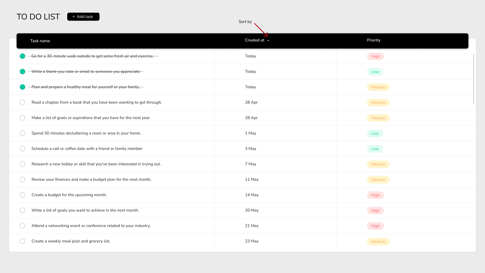

# React ToDo App Development Task

Hello and welcome!

We are excited to present you with a task where you'll be developing a ToDo application using React. This task is designed to test your React skills, attention to detail, and ability to work with external APIs. Don't worry, we've got all the assets and instructions you need!

## The Task

Your task is to create a ToDo app that interacts with an already provided ToDo API. The application should display the tasks in a table as shown in the screenshot provided. The main screen of the app should be designed to match the screenshot. 
You will be using React for this task, and we expect you to leverage best practices for state management, component structure, and other aspects of a modern React application.



## Design

To help you with the design, we have provided a screenshot of the application, a link to the Google font used in the app, and a Figma file. The Figma file should provide you with more granular details about the app's design. Your task is to replicate this design as closely as possible, focusing particularly on the main screen.

- Google Font - [Nunito](https://fonts.google.com/specimen/Nunito?query=nunito)
- Figma Design - [ToDo App Design](https://www.figma.com/file/bWThNKVhrueQ2T6Av8Erh8/To-do-list?node-id=0%3A1&t=J5sGg96ADAltbOFc-1)
- Screenshots of the app

## What we're looking for

- Clean, modular, and maintainable code
- Clear state management
- Accurate implementation of the design
- Correct usage of the provided API
## Instructions

Create a new React application using `create-react-app` / `vite` or any other method you prefer.

The task is divided into 6 steps. please pass each step at a time, but keep previous steps working. Try to complete as many steps as you can:
  1. Start with implementing the basic functionality using local state - present a list of mock todo items in the main table + support sorting (by default items should be sorted by their created time ascending).
  2. Make the table look as closely as you can to the design in the screenshots and Figma.
  3. Add the top bar - TODO title, tasks summary legend and avatar.
  4. Allow filtering by Incomplete / All.
  5. Add the "Add todo" wizard.
  6. Make everything work against the API.

We know that this is a short time frame to get everything done, so please advance in the steps according to this order.

Your application should be able to run locally using the `npm start` command.

Feel free to use your favorite packages or assistance via ChatGPT

Please note that the task is time-bound and should be completed within 3 hours.

## Submission

Once you've finished, please follow these steps to submit your work:

1. Ensure all of your code is committed to your local Git repository.
2. Zip your entire project directory, or push your code to a GitHub repository.
3. Use [this form](https://forms.monday.com/forms/6ef7a9dd1dfa409814ecec052fcb7ad0?r=use1) to upload your solution.

Please make sure you submit your solution within the time frame.

## Few words

Remember, this is not just about getting the task done; we want to see your problem-solving skills, creativity, and attention to detail. Good luck, and most importantly, have fun! 

We are looking forward to reviewing your solution!


-----

# Todo API Documentation

This documentation provides detailed instructions on how to interact with the Todo API.

## API Key

All API requests require an API Key. The API Key should be included in the headers of each request as follows:

```
headers: {
  'x-api-key': 'YOUR_API_KEY',
}
```

## Endpoints

### GET /todos

Fetches a list of all todo items.

#### Optional Parameters

- `sort_by`: (string) The attribute by which to sort the todos. Possible values: `priority`, `status`, `created_at`.
- `sort_order`: (string) The order in which to sort the todos. Possible values: `asc` (ascending), `desc` (descending).
- `filter_status`: (string) The status of the todos to filter. Possible values: `complete`, `incomplete`.

Example Request:

```
fetch('https://api.example.com/todos?sort_by=priority&sort_order=desc&filter_status=incomplete', {
  headers: {
    'x-api-key': 'YOUR_API_KEY',
  }
})
.then(response => response.json())
.then(data => console.log(data));
```

### PUT /todos/{id}/status

Updates the status of a specific todo item.

Parameters:

- `id`: (string) The ID of the todo item.
- `status`: (string) The new status of the todo item. Possible values: `complete`, `incomplete`.

Example Request:

```
fetch('https://api.example.com/todos/TODO_ID/status', {
  method: 'PUT',
  headers: {
    'x-api-key': 'YOUR_API_KEY',
    'Content-Type': 'application/json',
  },
  body: JSON.stringify({
    status: 'complete',
  }),
})
.then(response => response.json())
.then(data => console.log(data));
```

### PUT /todos/{id}/priority

Updates the priority of a specific todo item.

Parameters:

- `id`: (string) The ID of the todo item.
- `priority`: (number) The new priority of the todo item. Possible values: 1-3.

Example Request:

```
fetch('https://api.example.com/todos/TODO_ID/priority', {
  method: 'PUT',
  headers: {
    'x-api-key': 'YOUR_API_KEY',
    'Content-Type': 'application/json',
  },
  body: JSON.stringify({
    priority: 3,
  }),
})
.then(response => response.json())
.then(data => console.log(data));
```

### POST /todos

Creates a new todo item.

Parameters:

- `title`: (string) The title of the todo item.
- `priority`: (number) The priority of the todo item. Possible values: 1-5.

Example Request:

```
fetch('https://api.example.com/todos', {
  method: 'POST',
  headers: {
    'x-api-key': 'YOUR_API_KEY',
    'Content-Type': 'application/json',
  },
  body: JSON.stringify({
    title: 'New Todo',
    priority: 3,
  }),
})
.then(response => response.json())
.then(data => console.log(data));
```


